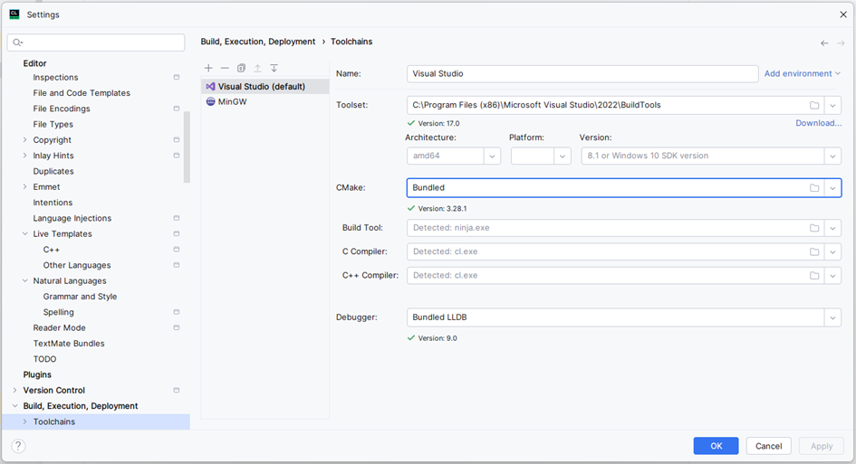
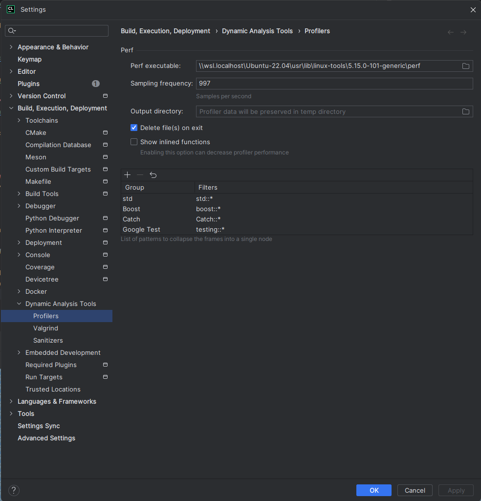
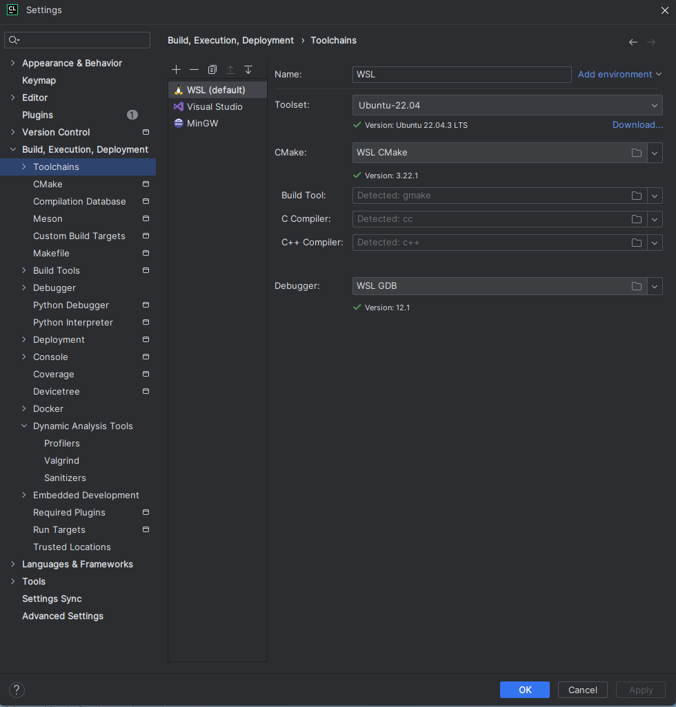

# Readme

## Installation 

### CMake
https://cmake.org/download/

Make sure CMake is added to the path variables.

### Visual Studio Build Tools
https://visualstudio.microsoft.com/de/downloads/

In CLion sollte das dann so aussehen.

### Installing Catch2 from git repository
https://github.com/catchorg/Catch2/blob/devel/docs/cmake-integration.md

The header file for Catch2 is already part of the Repo.

### Installing pybind into the project
1.	Navigate into network_cpp/lib
2.	Clone pybind11 Repo (https://github.com/pybind/pybind11) into this location 
3.  Install pybind11 as a python package (navigate to pybind dir and run "python setup.py install")

### General notes:
- In general, make sure that the cmake reads the right (higher level) make file (which then calls the lower level file)
- To profile:
  - Set up WSL Kernel (WSL 2) with Ubuntu 22.04
  - Install build tools and gdb (sudo apt-get install build-essential gdb)
  - Install python3 (sudo apt install python3)
  - Install profiler (apt install linux-tools-generic)
  - Set up new build tools configuration in IDE (see below for example)
  - Configure IDE such that profiler executes custom perf installation (see below for example)
- On the cluster:
  - load cmake 3.20.5 and gcc 11.1.0
  - create build folder (cd network_cpp && mkdir build && cd mkdir)
  - Build by 
    - cmake .. -DCMAKE_BUILD_TYPE="RELEASE" -DPython_ROOT_DIR="<path/to/venv>" 
    - cmake --build .
  - Note: you may have to add the index to the archive of "./network_cpp_catch2.cpython-310-x86_64-linux-gnu.so" by running ranlib on this file ("ranlib network_cpp_catch2.cpython-310-x86_64-linux-gnu.so")
- After succesfully building the project, install it as a python package by "pip install ./network_cpp" (on the cluster I had to manually install wheel --> "pip install wheel")

